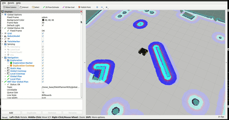
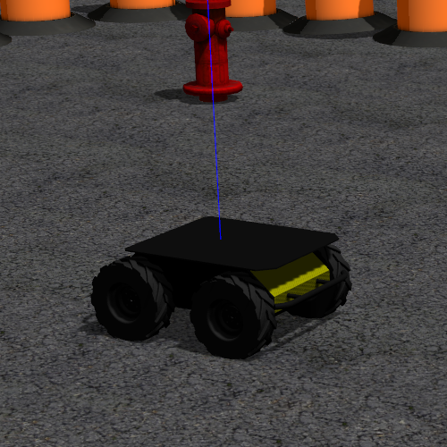
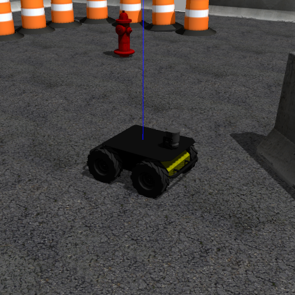

# `rrt_star_global_planner`
[](https://github.com/rafaelbarretorb/rrt_star_global_planner/actions/workflows/action-melodic.yaml) [](https://github.com/rafaelbarretorb/rrt_star_global_planner/actions/workflows/action-noetic.yaml) [](https://github.com/rafaelbarretorb/rrt_star_global_planner/actions/workflows/action-ros-ci.yaml)


<p float="left">
  
</p>

This is a ROS Global Planner Plugin that implements the RRT* (Rapidly-exploring Random Tree Star) path planning algorithm.

## RRT* Algorithm Performance

For better performance, fork this repository and improve your own global planner plugin implementing newer variations of the RRT* algorithm as, for example, the **RRT\*-Smart** or **Dual-Tree RRT\*-Smart**. I implemented these algorithms in this repository [Path-Planning-Pygame](https://github.com/rafaelbarretorb/Path-Planning-Pygame) using Python and they reach low-cost paths much faster.

## ROS Distros

Plugin tested in Melodic and Noetic Distros.


## Clearpath Husky Robot Simulator

If you decided to test this plugin using Husky Robot Simulator you can install it with the following instructions:

```
$ cd ~/catkin_ws/src   
$ git clone --branch <distro-branch-name> https://github.com/husky/husky.git
$ cd ..
$ catkin_make
$ sudo apt-get install ros-<distro-name>-gazebo-ros-pkgs ros-<distro-name>-gazebo-ros-control
$ sudo apt-get install ros-<distro-name>-multimaster-launch
$ sudo apt-get install ros-<distro-name>-lms1xx
$ rosdep install --from-path src --ignore-src  
$ catkin_make 
$ source devel/setup.bash

```

## Enable the Laser Scan Sensor

The Navigation Stack needs a perception sensor to work and the husky package does not enable it by default in the main distro branches. So you have to enable at least one sensor manually. The robot description has some available sensors and the simpler one is the laser scan LMS1XX. This sensor is enough to test the path planner. Therefore, **set 1** in the parameter laser_enabled as shown below:

```
<!-- File husky.urdf.xacro -->
<!-- Location: ~/catkin_ws/src/husky/husky_description/urdf/husky.urdf.xacro -->
<xacro:arg name="laser_enabled" default="$(optenv HUSKY_LMS1XX_ENABLED 1)" />
```

<p float="left">
  
   
</p>


## Tutorial: Writing A Global Path Planner As Plugin in ROS

I followed the Tutorial [Writing A Global Path Planner As Plugin in ROS](http://wiki.ros.org/navigation/Tutorials/Writing%20A%20Global%20Path%20Planner%20As%20Plugin%20in%20ROS) and study the source code of the global_planner package of the [Navigation Stack](https://github.com/ros-planning/navigation). After following all steps of the sessions 1 and 2 of the Tutorial:

**1. Writing the Path Planner Class**
Same instructions.

**2. Writing your Plugin**
Same instructions.

**3. Running the Plugin on the Husky Robot using Gazebo Simulator**

In the launch file *move_base.launch*, to load this plugin after all steps of the Tutorial you have to insert the default value of the "base_global_planner" to "rrt_star_global_planner/RRTStarPlanner" as shown below (you should comment or remove the default global planner value "navfn/NavfnROS").

```
<!-- move_base.launch -->
<!-- ~/catkin_ws/src/husky/husky_navigation/launch/move_base.launch -->
<!-- Planners -->
<!-- <arg name="base_global_planner" default="navfn/NavfnROS"/> -->
<arg name="base_global_planner" default="rrt_star_global_planner/RRTStarPlanner"/>
```

In the configuration YAML file of the navigation planners *planner.yaml* you should insert the parameters values of the new planner:

```
<!-- File planner.yaml -->
<!-- ~/catkin_ws/src/husky/husky_navigation/config/planner.yaml -->
RRTStarPlanner:
  goal_tolerance: 0.2
  radius: 1.0
  epsilon: 0.2
  max_num_nodes: 10000
  min_num_nodes: 1000

```
**4. Testing the planner with Gazebo Simulator and Rviz**

In three separate terminals, execute these three launch commands:

```
roslaunch husky_gazebo husky_playpen.launch
roslaunch husky_navigation amcl_demo.launch
roslaunch husky_viz view_robot.launch
```
The amcl_demo.launch file launchs the *move_base.launch* file edited above and the all navigation packages. The *view_robot.launch* file run the RViz with the proper topics configuration. 

Lastly, on the left side at "Display" part, change the name of the topic related to Global Planner to visualize it. If you using the DWA Local Planner the topic name is "/move_base/DWAPlannerROS/global_plan".

To test the plugin just click on "2D Nav Goal" button (at the top) and choose a goal location. You can now see that path generated by this planner (in green) and the robot moving to its goal if everything is fine.

**

## Unit Tests
Launch the tests verification:

```rostest rrt_star_global_planner rrt_star.test```

Or build manually at ```~catkin_ws/build```:

```$ make tests```

and execute each test manually at ```~catkin_ws/devel/lib/rrt_star_global_planner```:

```$ ./test_rrt_star ```

## Errors and Issues

If you find some error or issue, please create a new issue and help me to improve this package.
